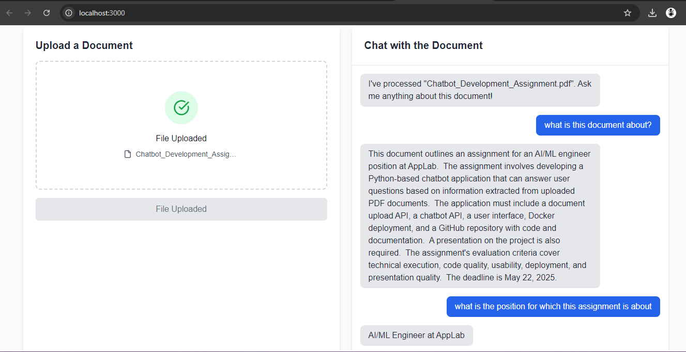

#  DocuChat AI – PDF Question Answering Chatbot

DocuChat AI is a fully containerized, production-ready chatbot system that allows users to upload any PDF document and interact with its contents through natural language questions.

Powered by:
-  FastAPI + LangChain
-  FAISS for semantic search
-  Gemini Pro (Google Generative AI)
-  React (Next.js) + TailwindCSS frontend
-  Docker for seamless deployment

---

##  Demo

 <!-- Optional: Add a screenshot or GIF of the UI -->

---

##  Features

-  Upload a PDF and instantly start chatting
-  Uses vector embeddings and semantic search
-  Retrieves context chunks using FAISS
-  Gemini Pro for intelligent responses
-  Next.js + TailwindCSS based modern UI
-  Dockerized backend and frontend for easy deployment

---

##  Tech Stack

| Layer       | Tools / Frameworks                        |
|-------------|--------------------------------------------|
| Backend     | FastAPI, LangChain, FAISS, Gemini Pro, PyPDF2 |
| Frontend    | React (Next.js), TailwindCSS               |
| Embeddings  | Google Generative AI (`langchain-google-genai`) |
| Vector DB   | FAISS (in-memory)                         |
| DevOps      | Docker, Docker Compose                    |

---

##  Project Architect


---

##  Local Setup Instructions

### 1. Clone the Repo

```bash
git clone https://github.com/khanArham0029/Applab_Chatbot.git
cd DocuChat-AI
```

### 2. Set Up the Backend

```bash
cd backend
python -m venv venv
source venv/bin/activate  # or venv\Scripts\activate on Windows
pip install -r requirements.txt
```

Create a `.env` file inside `/backend`:

```
GOOGLE_API_KEY=your_gemini_api_key
```

Then run:

```bash
uvicorn app.main:app --reload
```

Visit: [http://localhost:8000/docs](http://localhost:8000/docs)

---

### 3. Set Up the Frontend

```bash
cd ../frontend_testing/docuchat-ai (1)
npm install
npm run dev
```

Visit: [http://localhost:3000](http://localhost:3000)

---

##  Docker Setup (Recommended)

Ensure Docker and Docker Compose are installed.

### 1. Build & Start Containers

From the root folder:

```bash
docker-compose up --build
```

- Frontend: [http://localhost:3000](http://localhost:3000)
- Backend: [http://localhost:8000/docs](http://localhost:8000/docs)

### 2. Environment Setup

Update `backend/.env`:

```env
GOOGLE_API_KEY=your_gemini_api_key
```

---

##  API Endpoints

| Endpoint        | Method | Description                          |
|-----------------|--------|--------------------------------------|
| `/api/upload`   | POST   | Uploads and processes a PDF document |
| `/api/chat`     | POST   | Accepts a question and returns an answer based on uploaded doc |

---

##  Environment Variables

Create a `.env` file in `/backend`:

```env
GOOGLE_API_KEY=your_gemini_api_key
```

---


> Generated on May 18, 2025
